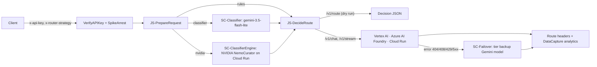

# Apigee AI Gateway: Model Routing Demo

Apigee X acts as an **AI gateway**: for every prompt, a pluggable decision step picks the right model
(cost vs capability), calls it and reports *which model and why*. The demo focuses on the routing logic, so all
calls use a single developer app (`llm-router-premium-app`); there is no app or plan choice in the UI.



## Endpoints (`https://YOUR_APIGEE_HOST/llm-router`)
| Method | Path | Purpose |
|---|---|---|
| POST | `/v1/route` | Dry run: returns the routing decision only (no LLM cost) |
| POST | `/v1/chat` | Routes and calls the chosen model; decision returned in `x-route-*` headers |
| POST | `/v1/stream` | Same routing, answer returned as Gemini-style SSE. Served by a separate `stream` ProxyEndpoint with `response.streaming.enabled` |

Body: `{"prompt":"..."}` or Gemini-native `{"contents":[...], "generationConfig":{...}}`.

| Header | Meaning |
|---|---|
| `x-router-strategy` | `rules` \| `classifier` \| `nvidia` (allow-listed; default from `routing.properties`) |
| `x-preferred-model-<tier>` | Override the model for one tier (`simple`, `standard`, `complex`, `coding`) |
| `x-preferred-model` | Override the model for every tier (used by the UI's **Static Routing**) |
| `x-simulate-outage: primary` | Demo only (`allow_outage_simulation=true`): points the chosen model's call at a non-existent path on the same host (HTTP 404) to trigger failover |

Response headers: `x-routed-model` (the model that actually answered), `x-route-tier`, `x-route-decided-by`,
`x-route-confidence`, `x-route-reason`, `x-route-fallback`, `x-route-decision-ms`, and on failover
`x-route-failover-from` / `x-route-failover-reason`.

## Tiers and default models
| Tier | Default model | Thinking |
|---|---|---|
| simple | `gemini-3.5-flash-lite` | default |
| standard | `gemini-3.5-flash` | default |
| complex | `gemini-3.1-pro-preview` | `high` |
| coding | `gemini-2.5-pro` | `medium` |

Defaults and thinking levels live in [routing.properties](apigee-proxies/llm-router/apiproxy/resources/properties/routing.properties)
(`model_<tier>`, `thinking_<tier>`; allowed thinking values: `minimal|low|medium|high|default`).

## Decision strategies
| Strategy | Logic | Tiers it can pick | Overhead |
|---|---|---|---|
| `rules` | Prompt length only: < 160 chars → simple, ≥ 1,500 → complex, otherwise standard (confidence 1.0) | simple, standard, complex | ~0 ms |
| `classifier` | Gemini 3.5 Flash-Lite (`thinkingLevel: minimal`, temp 0), schema-enforced JSON `{tier, domain, confidence, reason}` | all four | ~1.0–1.4 s |
| `nvidia` | Self-hosted **NVIDIA NemoCurator** prompt-task-and-complexity classifier (DeBERTa-v3) on private Cloud Run; first match wins: Code Generation / System Design → coding, reasoning ≥ 0.4 or (domain ≥ 0.9 and constraints ≥ 0.45) → complex, complexity < 0.15 and reasoning < 0.2 → simple, else standard | all four | ~35–50 ms |

Safety net: if a classifier verdict is missing, invalid, times out or is below its minimum confidence
(`min_confidence` 0.5; NVIDIA `task_prob` 0.2), the proxy falls back to `rules` (`decided_by: "rules (fallback)"`).

The proxy also still contains an `external` strategy (ServiceCallout to TargetServer `jev-engine`, e.g. TypeSafe AI JEV).
It is hidden from the UI for now.

## Model failover
If the chosen model's call fails (any status ≥ 400 except 400/413, e.g. 404, 408, 429, 5xx), the target response flow
retries **once** on the tier's backup Gemini model on Vertex AI and returns that answer instead of an error:

| Tier | Backup (`failover_<tier>`) |
|---|---|
| simple | `gemini-3.5-flash` |
| standard | `gemini-3.5-flash-lite` |
| complex | `gemini-2.5-pro` |
| coding | `gemini-3.1-pro-preview` |

How it works: every target accepts all status codes (`success.codes`), so errors reach the target Response PreFlow
instead of the fault flow: `JS-FailoverCheck` → `AM-FailoverRequest` (the Gemini request saved by `JS-DecideRoute`
before provider translation, minus model-specific thinking config) → `SC-Failover` → `JS-FailoverApply`. The backup is
always Gemini, so no translation is needed; on `/v1/stream` the backup answer is sent as one SSE event. If the backup
also fails, the generic error body is returned (`AM-FaultResponse`). Turn it off with `failover_enabled=false`.

## Supported backends
| Model | Provider / hosting | Notes |
|---|---|---|
| Gemini 3.5 Flash-Lite, 3.5 Flash, 3.1 Pro (preview), 2.5 Pro | Vertex AI | `generateContent` / `streamGenerateContent` |
| Grok 4.6 | Vertex AI Model Garden (xAI) | |
| Claude Sonnet 4.5 | Vertex AI (Anthropic, `us-east5`) | Called via `rawPredict`; translated to/from Gemini format. On `/v1/stream` the answer arrives as one SSE event |
| GPT-4.1 Nano | Azure AI Foundry (`/openai/v1/chat/completions`) | Key from KVM `azure-secrets`; translated to/from Gemini format; `x-ratelimit-*` headers stripped. One SSE event on `/v1/stream` |
| Gemma 2:2b | Cloud Run (Ollama), Google ID token | Needs `roles/run.invoker` for the Apigee service account. One SSE event on `/v1/stream` |

## Setup / deploy
```bash
./scripts/setup.sh     # data collectors, target server, upload, products, apps (no deploy)
apigeecli apis deploy -n llm-router -o YOUR_PROJECT_ID -e default-dev \
  --sa YOUR_PROXY_SA@YOUR_PROJECT_ID.iam.gserviceaccount.com --ovr --wait --default-token
```
`setup.sh` still creates a free and a premium product/app; the demo only uses `llm-router-premium-app`.

## Run the demo
```bash
./scripts/demo.sh route   # decisions only (fetches the premium app key via apigeecli)
./scripts/demo.sh chat    # real model calls
```
Scenarios: the three strategies side by side on simple / standard / complex / coding prompts, and a prompt-injection attempt against the router.

## Web UI
```bash
cd web-ui && ./run.sh      # fetches the premium app key via apigeecli, serves http://localhost:8080
```
- **Dynamic Routing**: set the tier → model mapping, then pick a decision strategy (Rules / Classifier LLM / NVIDIA). Each strategy has a *View Details* dialog with its flow diagram.
- **Static Routing**: pin every prompt to one model from the catalog (all backends above).
- **Route & Send Request** (streaming: routing decision first, then the answer, rendered as Markdown) and **Compare Routing Strategies** (Dynamic Routing only: dry run of every strategy on the same prompt with a one-line agree/disagree verdict, the model each picks, why, decision time and model price; no model is called).
- Presets include two *tricky* prompts that show where length heuristics fail: **Short but Hard** (rules → Flash-Lite, classifiers → Pro) and **Long but Easy** (rules → Pro, classifiers → a cheaper tier).
- Option: **🔌 Simulate model outage** (sends `x-simulate-outage: primary`; watch the 🔁 failover banner). Its **How it works?** link opens a short explanation with the diagram from `docs/failover-logic.dot`.
- Left panel **Architecture** card: **View Architecture Diagram** opens the static vs dynamic routing diagram (source `docs/architecture.dot`, served as `/assets/architecture.png`). To re-render: `dot -Tpng -Gdpi=170 docs/architecture.dot -o docs/architecture.png && cp docs/architecture.png web-ui/public/assets/`.
- Visualises the pipeline, the routed model, confidence, reason, fallback / failover banners, tokens, per-request cost (with the saving vs the baseline) and latency.
- Session KPI strip: requests, routed cost, cost if every prompt went to the most expensive catalog model (Claude Sonnet 4.5, $3 / $15 per 1M tokens), % saved, average latency and model mix. List prices are in `web-ui/server.js` with their sources. Output tokens include thinking tokens (billed at the output price).
- Uses a BFF pattern: the API key stays in the local Node process. The server listens on 127.0.0.1 only, sets a strict CSP, checks Origin/Host and allow-lists strategies and model ids.

## Analytics
Data collectors `dc_routed_model`, `dc_route_tier`, `dc_route_decided_by`, `dc_route_decision_ms` and `dc_total_tokens`
feed the custom report **LLM Router - Model Mix and Tokens** (definition: [scripts/custom-report.json](scripts/custom-report.json)).
Open it from Console → Apigee → Analytics → Custom reports. To recreate it:
```bash
curl -X POST "https://apigee.googleapis.com/v1/organizations/YOUR_PROJECT_ID/reports" \
  -H "Authorization: Bearer $(gcloud auth application-default print-access-token)" \
  -H "Content-Type: application/json" -d @scripts/custom-report.json
```
Analytics data appears after a few minutes.

## Security notes
- API key + SpikeArrest on every call. The user tier (`x-user-tier`) comes from the API product, not from client headers.
- Prompt size limit (20k chars); strategy header is allow-listed; the UI server only forwards catalog model ids.
- Generic error bodies (backend details masked); route headers sanitised to printable ASCII.
- Gateway-only headers (`x-api-key`, `x-router-strategy`, `x-preferred-model*`, `x-simulate-outage`) are removed before every backend call, including Azure.
- Outage simulation never sends credentials to a different host (same host, bogus path); disable it in production with `allow_outage_simulation=false`.
- TODO(security): add Model Armor `SanitizeUserPrompt` before routing, and authentication to the JEV engine.
