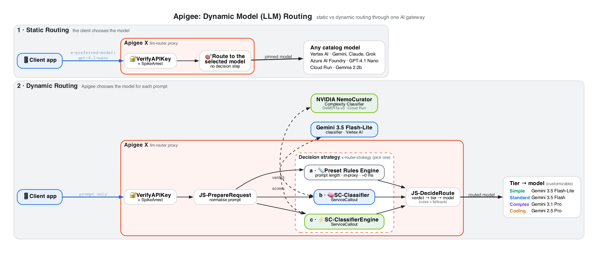
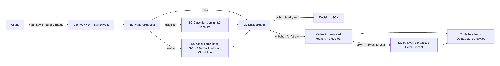
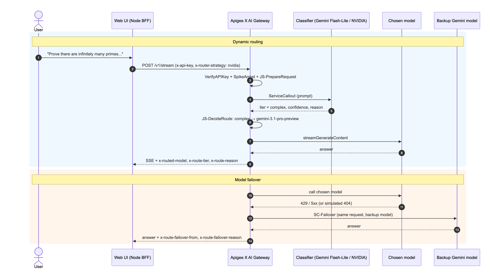
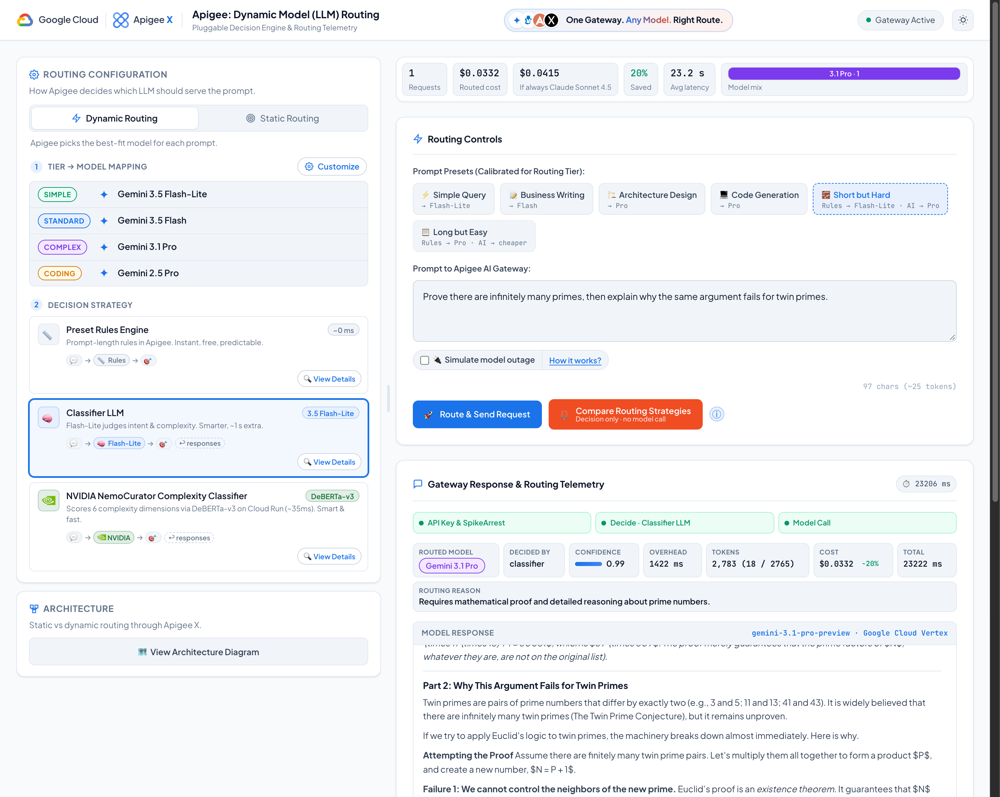

# Apigee X AI Gateway: Dynamic Model (LLM) Routing
### One Gateway. Any Model. Right Route. Cost-aware, pluggable model routing with failover for GenAI apps

[](https://cloud.google.com/apigee)
[](https://cloud.google.com/vertex-ai)
[](https://ai.azure.com)
[](https://huggingface.co/nvidia/prompt-task-and-complexity-classifier)
[](https://cloud.google.com/run)
[-339933?logo=nodedotjs&logoColor=white)](https://nodejs.org)
[](LICENSE)

---

> [!NOTE]
> ### 💡 AI Gateway reference: model routing
> This repository shows how **Google Cloud Apigee X** acts as an **AI Gateway** that decides, **per prompt**, which LLM should answer.
> Simple questions go to a cheap, fast model; hard reasoning and coding go to a premium one. The client never has to know which model exists.
>
> It features **three pluggable decision strategies** (a preset rules engine, a **Gemini 3.5 Flash-Lite** classifier and a self-hosted **NVIDIA NemoCurator** complexity classifier), **multi-provider backends** (Vertex AI, Azure AI Foundry, Cloud Run), **automatic model failover**, **routing telemetry** in response headers and Apigee Analytics, and a **web UI** that shows every decision and its cost.

---

## 🎯 Intention & Business Problem

Most GenAI apps hard-code one model. Pick a premium model and you overpay for "What's the capital of Japan?". Pick a cheap one and quality drops on hard prompts. Switching or mixing providers means changing every client.

```
┌─────────────────────────────────────────────────────────────────────────────┐
│                      THE MODEL SELECTION CHALLENGE                          │
└─────────────────────────────────────────────────────────────────────────────┘

  ❌ WITHOUT A GATEWAY: every app picks (and hard-codes) a model
  ┌──────────────┐        always the same model        ┌─────────────────────┐
  │  Client app  │ ──────────────────────────────────> │  Premium LLM        │
  └──────────────┘     keys and SDKs in every app      └─────────────────────┘
  • Overpaying: trivial prompts billed at premium rates.
  • Lock-in: a new model or provider means a client release.
  • No resilience: a model outage or 429 becomes a user-facing error.
  • No visibility: which model answered what, and at what cost?

  ─────────────────────────────────────────────────────────────────────────────

  ✅ WITH APIGEE X AS THE AI GATEWAY: the gateway picks the right model
  ┌──────────────┐          prompt only           ┌───────────────────────────┐
  │  Client app  │ ─────────────────────────────> │  Apigee X AI Gateway      │
  └──────────────┘        one API, one key        │  decide tier → pick model │
                                                  └─────────────┬─────────────┘
                                   ┌────────────────────────────┼──────────────────────┐
                                   ▼                            ▼                      ▼
                          Gemini 3.5 Flash-Lite        Gemini 3.1 Pro / 2.5 Pro   Claude · Grok · GPT · Gemma
  • Cost-aware: each prompt goes to the cheapest model that can handle it.
  • Pluggable: swap the decision strategy or the tier → model mapping without touching clients.
  • Resilient: if the chosen model fails, Apigee retries once on a backup Gemini model.
  • Observable: x-route-* headers and Analytics show model, tier, reason and decision time.
```

### Key Architectural Capabilities Demonstrated

1. **Dynamic routing with pluggable decision strategies**:
   * The client sends only the prompt. Apigee assigns a **tier** (`simple`, `standard`, `complex`, `coding`) and maps it to a model.
   * The strategy is chosen per request (`x-router-strategy`): a **preset rules engine** in the proxy, a **Gemini 3.5 Flash-Lite** classifier or the **NVIDIA NemoCurator** classifier, both called via `ServiceCallout`.
2. **Static routing**:
   * The client pins a model with `x-preferred-model`. Apigee skips the decision and routes straight to it: same API, same key, same telemetry.
3. **Multi-provider backends behind one API**:
   * Gemini, Claude and Grok on **Vertex AI**, GPT-4.1 Nano on **Azure AI Foundry** and Gemma 2 on **Cloud Run**. Apigee translates requests and responses to and from the Gemini format, so clients see one schema.
4. **Model failover**:
   * If the chosen model returns 404, 408, 429 or 5xx, Apigee retries **once** on the tier's backup Gemini model and returns that answer with `x-route-failover-*` headers.
5. **Routing telemetry and cost visibility**:
   * Every response carries `x-routed-model`, `x-route-tier`, `x-route-reason` and more. Data collectors feed an Apigee custom report, and the web UI shows per-request cost and savings.
6. **Gateway security**:
   * API key + SpikeArrest, prompt size limit, allow-listed headers, generic error bodies, secrets in KVM and Google ID tokens for private Cloud Run services.

---

## 🏛️ High-Level Architecture

<p align="center">
  
</p>

### Request flow inside the proxy

<p align="center">
  
</p>

<sub>Source: <a href="docs/request-flow.mmd">docs/request-flow.mmd</a> (Mermaid)</sub>

### End-to-end sequence

<p align="center">
  
</p>

<sub>Source: <a href="docs/sequence.mmd">docs/sequence.mmd</a> (Mermaid)</sub>

---

## 🧭 Decision Strategies

| Strategy (`x-router-strategy`) | How it decides | Tiers it can pick | Overhead |
| :--- | :--- | :--- | :--- |
| 📏 **`rules`**: Preset Rules Engine | Prompt length only, in the proxy: < 160 chars → simple, ≥ 1,500 → complex, otherwise standard (confidence 1.0) | simple, standard, complex | ~0 ms |
| 🧠 **`classifier`**: Gemini 3.5 Flash-Lite | `ServiceCallout` to Vertex AI (`thinkingLevel: minimal`, temp 0) with a schema-enforced JSON verdict `{tier, domain, confidence, reason}` | all four | ~1.0–1.4 s |
| 🟩 **`nvidia`**: NVIDIA NemoCurator | `ServiceCallout` to the self-hosted [prompt-task-and-complexity classifier](https://huggingface.co/nvidia/prompt-task-and-complexity-classifier) (DeBERTa-v3) on private Cloud Run. First match wins: Code Generation / System Design → coding; reasoning ≥ 0.4 or (domain ≥ 0.9 and constraints ≥ 0.45) → complex; complexity < 0.15 and reasoning < 0.2 → simple; else standard | all four | ~35–50 ms |

> [!TIP]
> **Safety net:** if a classifier verdict is missing, invalid, times out or is below its minimum confidence (`min_confidence` 0.5; NVIDIA `task_prob` 0.2), the proxy falls back to `rules` and reports `decided_by: "rules (fallback)"`.

The proxy also contains an `external` strategy (`ServiceCallout` to the TargetServer `jev-engine` for a third-party decision engine). It is hidden from the UI.

### Tiers and default models

| Tier | Default model (`model_<tier>`) | Thinking (`thinking_<tier>`) | Backup on failure (`failover_<tier>`) |
| :--- | :--- | :--- | :--- |
| simple | `gemini-3.5-flash-lite` | default | `gemini-3.5-flash` |
| standard | `gemini-3.5-flash` | default | `gemini-3.5-flash-lite` |
| complex | `gemini-3.1-pro-preview` | `high` | `gemini-2.5-pro` |
| coding | `gemini-2.5-pro` | `medium` | `gemini-3.1-pro-preview` |

All of these live in [routing.properties](apigee-proxies/llm-router/apiproxy/resources/properties/routing.properties). Clients can override one tier with `x-preferred-model-<tier>`, or every tier with `x-preferred-model` (Static Routing).

### Supported backends

| Model | Provider / hosting | Notes |
| :--- | :--- | :--- |
| Gemini 3.5 Flash-Lite, 3.5 Flash, 3.1 Pro (preview), 2.5 Pro | Vertex AI | `generateContent` / `streamGenerateContent` |
| Grok 4.6 | Vertex AI Model Garden (xAI) | |
| Claude Sonnet 4.5 | Vertex AI (Anthropic, `us-east5`) | `rawPredict`; translated to/from the Gemini format |
| GPT-4.1 Nano | Azure AI Foundry (`/openai/v1/chat/completions`) | Key from KVM `azure-secrets`; translated to/from the Gemini format; `x-ratelimit-*` headers stripped |
| Gemma 2 2B | Cloud Run (Ollama), Google ID token | Demo only (small CPU instance) |

Claude, GPT and Gemma answers arrive as one SSE event on `/v1/stream`.

---

## 🔁 Model Failover

Every target accepts all status codes (`success.codes`), so errors reach the target Response PreFlow instead of the fault flow:

```
JS-FailoverCheck ──> AM-FailoverRequest ──> SC-Failover ──> JS-FailoverApply
 (status ≥ 400,        (Gemini request        (tier backup     (replace the response,
  not 400/413?)         saved before           model on         add x-route-failover-*)
                        translation)           Vertex AI)
```

* The backup is always Gemini, so no translation is needed. On `/v1/stream` the backup answer is sent as one SSE event.
* If the backup also fails, the caller gets a generic error (`AM-FaultResponse`). Turn failover off with `failover_enabled=false`.
* **Try it:** send `x-simulate-outage: primary` (or tick 🔌 **Simulate model outage** in the UI). Apigee then calls the chosen model on a non-existent path on the same host (HTTP 404) and fails over. Disable this in production with `allow_outage_simulation=false`.

---

## 🔌 API Reference

Base path: `https://<your-apigee-host>/llm-router`

| Method | Path | Purpose |
| :--- | :--- | :--- |
| POST | `/v1/route` | Dry run: returns the routing decision only (no model call, no LLM cost) |
| POST | `/v1/chat` | Routes and calls the chosen model; decision returned in `x-route-*` headers |
| POST | `/v1/stream` | Same routing, answer as Gemini-style SSE (separate `stream` ProxyEndpoint with `response.streaming.enabled`) |

Body: `{"prompt":"..."}` or Gemini-native `{"contents":[...], "generationConfig":{...}}`.

| Request header | Meaning |
| :--- | :--- |
| `x-api-key` | Apigee app key (required) |
| `x-router-strategy` | `rules` \| `classifier` \| `nvidia` (allow-listed; default from `routing.properties`) |
| `x-preferred-model-<tier>` | Override the model for one tier (`simple`, `standard`, `complex`, `coding`) |
| `x-preferred-model` | Override the model for every tier (Static Routing) |
| `x-simulate-outage: primary` | Demo only: forces the chosen model's call to fail to show failover |

| Response header | Meaning |
| :--- | :--- |
| `x-routed-model` | The model that actually answered |
| `x-route-tier` / `x-route-decided-by` / `x-route-confidence` | Tier, strategy (or `rules (fallback)`) and confidence |
| `x-route-reason` / `x-route-fallback` | Why this tier; why the strategy fell back (if it did) |
| `x-route-decision-ms` | Time Apigee spent deciding |
| `x-route-failover-from` / `x-route-failover-reason` | Present only when failover happened |

Example:

```bash
curl -s -X POST "https://<your-apigee-host>/llm-router/v1/route" \
  -H "x-api-key: $API_KEY" -H "x-router-strategy: nvidia" \
  -H "Content-Type: application/json" \
  -d '{"prompt":"Write a Python function that parses an Apache access log and returns the top 10 IPs."}'
# {"model":"gemini-2.5-pro","tier":"coding","decided_by":"nvidia", ...}
```

---

## 🖥️ Demonstration Web UI

<p align="center">
  
</p>

### UI Capabilities & Highlights

* **Dynamic Routing**: set the tier → model mapping, then pick a decision strategy (Rules / Classifier LLM / NVIDIA). Each strategy has a *View Details* dialog with its flow diagram.
* **Static Routing**: pin every prompt to one model from the catalog.
* **Route & Send Request**: streams the routing decision first, then the answer (rendered as Markdown).
* **Compare Routing Strategies**: dry run of every strategy on the same prompt, with an agree/disagree verdict, the model each picks, why, decision time and model price. No model is called.
* **Tricky presets** that show where length heuristics fail: **Short but Hard** (rules → Flash-Lite, classifiers → Pro) and **Long but Easy** (rules → Pro, classifiers → a cheaper tier).
* **🔌 Simulate model outage** with a *How it works?* explainer, and **View Architecture Diagram** in the left panel.
* **Telemetry**: pipeline steps, routed model, confidence, reason, fallback / failover banners, tokens, per-request cost and latency.
* **Session KPIs**: requests, routed cost, cost if every prompt went to the most expensive catalog model (Claude Sonnet 4.5), % saved, average latency and model mix. List prices and their sources are in [server.js](web-ui/server.js).
* **BFF pattern**: the API key stays in the Node process and never reaches the browser. Locally the server listens on 127.0.0.1 only; on Cloud Run it sits behind Identity-Aware Proxy (IAP) and reads the key from Secret Manager. It sets a strict CSP, checks Origin/Host and allow-lists strategies and model ids. No npm dependencies.

---

## 📁 Repository Structure

```
apigee-model-routing-demo/
├── apigee-proxies/llm-router/apiproxy/    # The Apigee X proxy (AI gateway)
│   ├── proxies/                           # default (/v1/route, /v1/chat) and stream (/v1/stream)
│   ├── targets/                           # vertex, azure, gemma (+ -stream variants)
│   ├── policies/                          # VerifyAPIKey, SpikeArrest, ServiceCallouts, failover, KVM, DataCapture...
│   └── resources/
│       ├── jsc/                           # prepare-request, decide-route, failover, provider translators
│       └── properties/routing.properties  # tier → model, thinking, failover and thresholds
│
├── prompt-classifier/                     # NVIDIA NemoCurator classifier service (FastAPI, Cloud Run)
│   ├── Dockerfile                         # bakes the model weights into the image
│   ├── app.py / model.py                  # POST /v1/classify (+ /healthz)
│   ├── download_model.py                  # fetches weights from Hugging Face at build time
│   └── eval_local.py                      # local evaluation against sample prompts
│
├── gemma2-cloudrun/Dockerfile             # Ollama + gemma2:2b for Cloud Run (optional)
│
├── scripts/
│   ├── setup.sh                           # data collectors, target server, bundle, products, apps
│   ├── demo.sh                            # CLI scenarios (route | chat)
│   └── custom-report.json                 # Apigee Analytics custom report definition
│
├── web-ui/                                # Demo web app (Node.js 18+, zero dependencies)
│   ├── server.js                          # BFF: holds the API key, price list, allow-lists
│   ├── run.sh                             # fetches the app key via apigeecli, starts the server
│   ├── Dockerfile                         # container image for Cloud Run (node:22-slim, non-root)
│   ├── deploy-cloudrun.sh                 # deploys the UI to Cloud Run behind IAP
│   └── public/                            # index.html, app.js, styles.css, assets/
│
└── docs/                                  # Graphviz sources (.dot) and rendered diagrams (.png)
```

---

## 🛠️ Prerequisites & Technology Stack

### 1. Google Cloud services

| Product / Service | Role in this demo | Notes |
| :--- | :--- | :--- |
| **Apigee X** | AI gateway: auth, rate limiting, routing decision, provider translation, failover, telemetry | Apigee X org with an environment attached to an environment group and external ingress |
| **Vertex AI** | Gemini models (answers, classifier and failover), Claude (Anthropic) and Grok (xAI) via Model Garden | Enable the partner models you want in Model Garden; Claude runs in `us-east5` |
| **Cloud Run** | Private hosting for the NVIDIA classifier and Gemma | `--no-allow-unauthenticated`; Apigee calls them with Google ID tokens |
| **IAM** | Proxy service account | `roles/aiplatform.user` on the project; `roles/run.invoker` on both Cloud Run services |
| **Apigee Analytics** | Custom report on model mix, tiers and tokens | Via data collectors |

### 2. Third-party (optional)

| Product | Role | Notes |
| :--- | :--- | :--- |
| **NVIDIA NemoCurator prompt-task-and-complexity classifier** | Fast, self-hosted complexity scoring for the `nvidia` strategy | Downloaded from Hugging Face at image build time; check the model licence |
| **Azure AI Foundry** | GPT-4.1 Nano backend | API key stored in the Apigee KVM `azure-secrets` |
| **Ollama** | Serves Gemma 2 2B on Cloud Run | Demo only |

### 3. Workstation tools

* **Google Cloud SDK** (`gcloud`), authenticated:
  ```bash
  gcloud auth login
  gcloud auth application-default login
  ```
* **apigeecli**:
  ```bash
  curl -s https://raw.githubusercontent.com/apigee/apigeecli/main/downloadLatest.sh | bash
  export PATH=$PATH:$HOME/.apigeecli/bin
  ```
* **jq**, **curl** and **Node.js 18+** (for the web UI).
* **Graphviz** (optional, only to re-render diagrams: `dot -Tpng -Gdpi=170 docs/architecture.dot -o docs/architecture.png`).

---

## 🚀 Step-by-Step Setup & Deployment Guide

> [!IMPORTANT]
> Environment-specific values in this repo (project id and number, Apigee host, service account, Azure resource name) are placeholders that start with `YOUR_`. Search the repo for `YOUR_` and replace them with your own values before deploying.

### Step 1: Set environment variables

```bash
export PROJECT_ID="your-project-id"
export ORG="$PROJECT_ID"                 # Apigee org (usually the project id)
export ENV="your-apigee-env"
export REGION="asia-southeast1"          # Cloud Run region
export SA="apigee-llm-router@$PROJECT_ID.iam.gserviceaccount.com"
export APIGEE_HOST="https://your-apigee-host"
gcloud config set project "$PROJECT_ID"
gcloud services enable apigee.googleapis.com aiplatform.googleapis.com run.googleapis.com cloudbuild.googleapis.com
```

### Step 2: Create the proxy service account

```bash
gcloud iam service-accounts create apigee-llm-router --display-name "Apigee LLM router"
gcloud projects add-iam-policy-binding "$PROJECT_ID" --member "serviceAccount:$SA" --role roles/aiplatform.user
```

### Step 3: Deploy the NVIDIA classifier to Cloud Run (for the `nvidia` strategy)

```bash
gcloud run deploy prompt-classifier --source prompt-classifier --region "$REGION" \
  --no-allow-unauthenticated --cpu 4 --memory 4Gi --concurrency 4 --min-instances 1
gcloud run services add-iam-policy-binding prompt-classifier --region "$REGION" \
  --member "serviceAccount:$SA" --role roles/run.invoker
```

Put the service URL into [SC-ClassifierEngine.xml](apigee-proxies/llm-router/apiproxy/policies/SC-ClassifierEngine.xml) (URL and `<Audience>`).

### Step 4 (optional): Gemma on Cloud Run and GPT-4.1 Nano on Azure

```bash
# Gemma 2 2B (Ollama)
gcloud run deploy gemma2-api --source gemma2-cloudrun --region "$REGION" \
  --no-allow-unauthenticated --port 11434 --cpu 4 --memory 8Gi --min-instances 1
gcloud run services add-iam-policy-binding gemma2-api --region "$REGION" \
  --member "serviceAccount:$SA" --role roles/run.invoker

# Azure AI Foundry key in an environment KVM
apigeecli kvms create -e "$ENV" -n azure-secrets -o "$ORG" --default-token
apigeecli kvms entries create -e "$ENV" -m azure-secrets -k azure_api_key -l "$AZURE_API_KEY" -o "$ORG" --default-token
```

Update the Gemma and Azure URLs in `targets/gemma*.xml`, `targets/azure*.xml` and `resources/jsc/decide-route.js`.

### Step 5: Configure routing and deploy the proxy

1. Set `project` (and optionally the models, thinking levels and failover models) in [routing.properties](apigee-proxies/llm-router/apiproxy/resources/properties/routing.properties), and the project in [SC-Classifier.xml](apigee-proxies/llm-router/apiproxy/policies/SC-Classifier.xml).
2. Create data collectors, target server, products, developer and apps, and upload the bundle:
   ```bash
   ORG=$ORG ENV=$ENV SA=$SA ./scripts/setup.sh
   ```
3. Deploy with the service account:
   ```bash
   apigeecli apis deploy -n llm-router -o "$ORG" -e "$ENV" --sa "$SA" --ovr --wait --default-token
   ```

`setup.sh` creates a free and a premium product/app; the demo uses `llm-router-premium-app`.

### Step 6: Try it from the CLI

```bash
HOST=$APIGEE_HOST ORG=$ORG ./scripts/demo.sh route   # decisions only, no LLM cost
HOST=$APIGEE_HOST ORG=$ORG ./scripts/demo.sh chat    # real model calls
```

The script runs the three strategies side by side on simple / standard / complex / coding prompts, plus a prompt-injection attempt against the router.

### Step 7a: Launch the web UI locally

```bash
cd web-ui
ORG=$ORG APIGEE_HOST=$APIGEE_HOST ./run.sh   # fetches the app key via apigeecli
# open http://localhost:8080
```

### Step 7b (optional): Deploy the web UI to Cloud Run behind IAP

To share the demo without making it public, use [deploy-cloudrun.sh](web-ui/deploy-cloudrun.sh). It builds the UI from source and deploys it as a private Cloud Run service protected by [IAP for Cloud Run](https://cloud.google.com/run/docs/securing/identity-aware-proxy-cloud-run):

```bash
PROJECT_ID=$PROJECT_ID ORG=$ORG APIGEE_ENV=$ENV APIGEE_HOST=$APIGEE_HOST \
REGION=asia-southeast1 IAP_MEMBERS="user:you@example.com,group:team@example.com" \
  ./web-ui/deploy-cloudrun.sh
```

What the script does (it is idempotent, so you can safely re-run it):

1. Enables the Cloud Run, IAP, Secret Manager, Cloud Build and Artifact Registry APIs.
2. Reads the `llm-router-premium-app` key with apigeecli and stores it in the Secret Manager secret `llm-router-ui-api-key`. The key is never printed. Set `ROTATE_KEY=1` to store a new version.
3. Creates a dedicated runtime service account, `llm-router-ui-sa`, that can only read that secret.
4. Runs `gcloud run deploy --source … --iap --no-allow-unauthenticated` and injects the key as `PREMIUM_KEY` from Secret Manager (1 vCPU, 512 MiB, scales to zero, max 2 instances).
5. Grants `roles/run.invoker` to the IAP service agent (`service-PROJECT_NUMBER@gcp-sa-iap.iam.gserviceaccount.com`).
6. Grants `roles/iap.httpsResourceAccessor` to every member in `IAP_MEMBERS`, then prints the service URL.

Optional variables: `SERVICE` (default `llm-router-ui`), `APP_NAME`, `SECRET`, `CUSTOM_DOMAIN`.

**Custom domain (optional).** Set `CUSTOM_DOMAIN=demo.example.com`. The script allow-lists the host in the server (`PUBLIC_HOSTS`) and creates a [Cloud Run domain mapping](https://cloud.google.com/run/docs/mapping-custom-domains). The domain must be verified for your account (`gcloud domains verify example.com`). Then add the DNS record the script prints, for example with Cloud DNS:

```bash
gcloud dns record-sets create demo.example.com. --zone YOUR_ZONE --type CNAME --ttl 300 --rrdatas ghs.googlehosted.com.
gcloud beta run domain-mappings describe --domain demo.example.com --region "$REGION"   # wait for the certificate
```

IAP applies to the custom domain too, because it is enabled on the service itself. The managed certificate usually takes 15–60 minutes.

To manage who can open the UI later:

```bash
# add a user
gcloud iap web add-iam-policy-binding --resource-type=cloud-run --service=llm-router-ui \
  --region="$REGION" --member="user:colleague@example.com" --role=roles/iap.httpsResourceAccessor
# remove a user
gcloud iap web remove-iam-policy-binding --resource-type=cloud-run --service=llm-router-ui \
  --region="$REGION" --member="user:colleague@example.com" --role=roles/iap.httpsResourceAccessor
# list members
gcloud iap web get-iam-policy --resource-type=cloud-run --service=llm-router-ui --region="$REGION"
```

> [!NOTE]
> Unauthenticated requests are redirected to Google sign-in, and signed-in users who are not in `IAP_MEMBERS` get a 403. If your organisation enforces domain-restricted sharing (`iam.allowedPolicyMemberDomains`), members must belong to an allowed domain.

### Step 8 (optional): Analytics custom report

```bash
curl -X POST "https://apigee.googleapis.com/v1/organizations/$ORG/reports" \
  -H "Authorization: Bearer $(gcloud auth application-default print-access-token)" \
  -H "Content-Type: application/json" -d @scripts/custom-report.json
```

Open **Console → Apigee → Analytics → Custom reports → "LLM Router - Model Mix and Tokens"**. Data appears after a few minutes (dimensions: `dc_routed_model`, `dc_route_tier`, `dc_route_decided_by`, `dc_route_decision_ms`, `dc_total_tokens`).

---

## 🎭 Demonstration Scenarios

### Scenario 1: Same prompt, different strategies
Pick **Short but Hard** ("Prove there are infinitely many primes, then explain why the same argument fails for twin primes.") and click **Compare Routing Strategies**. The rules engine sees a short prompt and picks Flash-Lite; both classifiers recognise the reasoning and pick Pro.

### Scenario 2: Where length lies
Pick **Long but Easy**. Rules sends it to Pro because it is long; the classifiers send it to a cheaper tier. Watch the **Saved** KPI.

### Scenario 3: Cost-aware routing in action
Send the four calibrated presets (Simple Query, Business Writing, Architecture Design, Code Generation) with the NVIDIA strategy. Each lands on a different model; the KPI strip compares the routed cost with "always Claude Sonnet 4.5".

### Scenario 4: Model outage and failover
Tick **🔌 Simulate model outage** and send any prompt. The chosen model returns 404; Apigee fails over to the tier's backup Gemini model, and the UI shows the 🔁 failover banner and an amber Model Call step.

### Scenario 5: Static routing
Switch to **Static Routing** and pin GPT-4.1 Nano (Azure) or Claude Sonnet 4.5. Same API, same key; Apigee translates the request and response.

---

## 🔐 Security Notes

* API key + SpikeArrest on every call. The user tier (`x-user-tier`) comes from the API product, never from client headers.
* Prompt size limit (20k chars); strategy header allow-listed; the UI server only forwards catalog model ids.
* Generic error bodies (backend details masked); route headers sanitised to printable ASCII.
* Gateway-only headers (`x-api-key`, `x-router-strategy`, `x-preferred-model*`, `x-simulate-outage`) are removed before every backend call, including Azure.
* Secrets: the Azure key lives in an Apigee KVM; Cloud Run services are private and accept only the proxy service account's ID token.
* Hosted web UI: runs on Cloud Run with IAP and `--no-allow-unauthenticated`. The Apigee app key sits in Secret Manager and only a dedicated runtime service account can read it. The container runs as a non-root user. On Cloud Run the server accepts only its own `*.run.app` host; add custom domains with `PUBLIC_HOSTS`.
* Outage simulation never sends credentials to a different host (same host, bogus path). Disable it in production with `allow_outage_simulation=false`.
* **Production to-dos:** add Model Armor (`SanitizeUserPrompt`) before routing, and authentication for the external decision engine.

---

## 🧹 Teardown & Resource Cleanup

```bash
A="apigeecli --default-token -o $ORG"
$A apis undeploy -n llm-router -e "$ENV"                 # undeploys the highest revision
$A developers delete -n llm-router-demo@example.com      # also deletes its apps
$A products delete -n llm-router-free
$A products delete -n llm-router-premium
$A apis delete -n llm-router
$A targetservers delete -e "$ENV" -n jev-engine
$A kvms delete -e "$ENV" -n azure-secrets
for d in dc_routed_model dc_route_tier dc_route_decided_by dc_route_decision_ms dc_total_tokens; do $A datacollectors delete -n "$d"; done

gcloud run services delete prompt-classifier --region "$REGION" --quiet
gcloud run services delete gemma2-api --region "$REGION" --quiet

# hosted web UI (Step 7b); deleting the service also removes its IAP bindings
gcloud run services delete llm-router-ui --region "$REGION" --quiet
gcloud secrets delete llm-router-ui-api-key --quiet
gcloud iam service-accounts delete "llm-router-ui-sa@$PROJECT_ID.iam.gserviceaccount.com" --quiet
# if you used CUSTOM_DOMAIN
gcloud beta run domain-mappings delete --domain demo.example.com --region "$REGION" --quiet
gcloud dns record-sets delete demo.example.com. --zone YOUR_ZONE --type CNAME
```

> [!CAUTION]
> These commands delete resources permanently. The Cloud Run services use `--min-instances 1`, so they bill while running; delete them (or set min instances to 0) when you're done.

---

## 📚 Additional Resources

* [Apigee X documentation](https://cloud.google.com/apigee/docs)
* [Apigee ServiceCallout policy](https://cloud.google.com/apigee/docs/api-platform/reference/policies/service-callout-policy)
* [Vertex AI Gemini API](https://cloud.google.com/vertex-ai/generative-ai/docs/model-reference/inference)
* [Claude on Vertex AI](https://cloud.google.com/vertex-ai/generative-ai/docs/partner-models/claude)
* [NVIDIA prompt-task-and-complexity classifier](https://huggingface.co/nvidia/prompt-task-and-complexity-classifier)
* [Azure AI Foundry](https://learn.microsoft.com/azure/ai-foundry/)
* [apigeecli](https://github.com/apigee/apigeecli)

---

## 📄 License

Licensed under the [Apache License 2.0](LICENSE). Third-party models and services (NVIDIA NemoCurator classifier, Gemma, Claude, Grok, GPT-4.1) are subject to their own licences and terms.

> [!NOTE]
> This is a demo, not an official Google product. Model prices shown in the UI are public list prices for illustration only.
